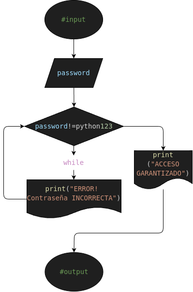

# ej1: password_validator
Programa en Python para confirmar si la contraseña ingresada es Correcta o Incorrecta

## Analisis

### Descripcion (Detallada)

- Estás creando una app y quieres que el usuario no pueda avanzar hasta que introduzca la clave correcta. Problema: Crea un programa que pida una contraseña. Si es incorrecta, debe decir "Error" y pedirla de nuevo. Si es "python123", debe decir "Acceso concedido"

### Variable de entrada (#input)
- password= Contraseña (ingresada)

### Procesamiento y Almacenamiento (#processing&storage)
- correct_password= Contraseña correcta ("python123")
---
-  while(password != correct_password): 
    - print("ERROR!: Contraseña INCORRECTA") 
    - password=input("Vuelve a digitar la Contraseña: ") 

## Diseño

## Construccion
- C0D1G0 1MPL3M3NT4D0 EN "ej1.py"