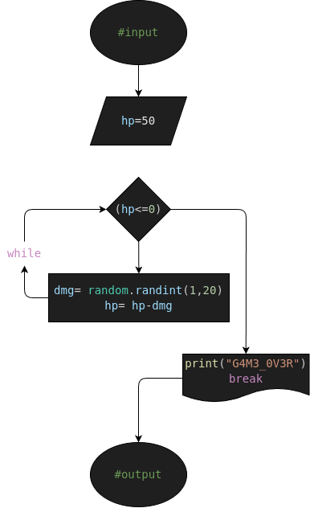

# ej1: hp_drain_system
Programa en Python para quitar HP (Healt Points) en cada turno del jefe

## Analisis

### Descripcion (Detallada)

- Tu personaje tiene 50 puntos de vida (HP). En cada turno, el jefe te quita una cantidad aleatoria de vida. Si tu vida baja de 0, pierdes.  Para este ejercicio consulte y haga uso de la instrucción break.

### Variable de entrada (#input)
- hp= 50

### Procesamiento y Almacenamiento (#processing&storage)
- while True:
    - dmg= random.randit(1,20)
    - hp= hp-dmg

    - print("El Jefe te ataco y te quito " +str(dmg) +" de vida")
    - print("Ahora tienes " +str(hp) +" de vida restante")

## Diseño

## Construccion
- C0D1G0 1MPL3M3NT4D0 EN "ej2.py"