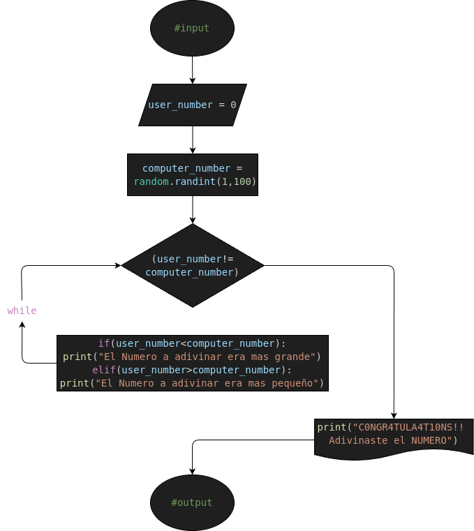

# ej3: guess_the_number
Programa en Python para confirmar si la contraseña ingresada es Correcta o Incorrecta

## Analisis

### Descripcion (Detallada)

- Crea un juego donde la computadora elija un número del 1 al 100 y el usuario tenga que adivinarlo. El bucle while debe repetirse hasta que el usuario acierte. El programa debe dar pistas: "Más alto" o "Más bajo"

### Variable de entrada (#input)
- computer_number = random.randint(1,100)
- user_number = 0

### Procesamiento y Almacenamiento (#processing&storage)
- while(user_number!=computer_number):
    - user_number=int(input("¿Qué número será?: "))

    - if(user_number<computer_number):
        - print("El Numero a adivinar era mas grande")
    - elif(user_number>computer_number):
        - print("El Numero a adivinar era mas pequeño")

### Variable de salida (#output)
- print("C0NGR4TULA4T10NS!! Adivinaste el NUMERO")

## Diseño

## Construccion
- C0D1G0 1MPL3M3NT4D0 EN "ej3.py"