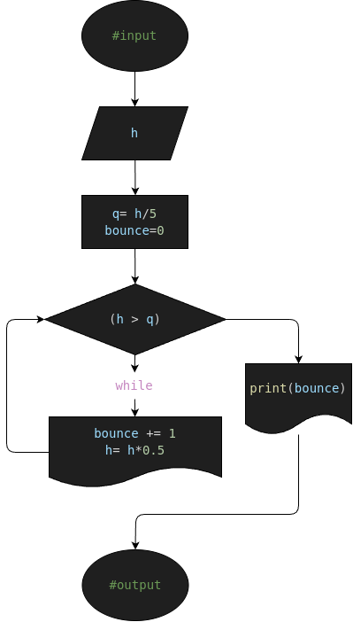

# ej4: h_calculator
Programa en Python para calcular la altura h de una Pelota

## Analisis

### Descripcion (Detallada)

- Una pelota se deja caer desde una altura h, y en cada rebote sube el 10% menos del anterior.  Hacer el diagrama de flujo y el programa en Python, que lea h, y que calcule e imprima en cuál rebote la pelota no alcanza a subir la quinta parte de la altura inicial.

### Variable de entrada (#input)
- h

### Procesamiento y Almacenamiento (#processing & storage)
- q= h/5
- bounce=0
---
- while(h > q):
    - bounce += 1
    - h= h*0.5
    - if(h < q):
        - print("N° de veces que reboto la pelota ANTES de llegar a la 5ta parte de la altura inicial: ", bounce)

### Variable de salida (#output)
        - print("Awebo :3!! La pelota reboto varias veces >w<!!")
## Diseño

## Construccion
- C0D1G0 1MPL3M3NT4D0 EN "ej4.py"