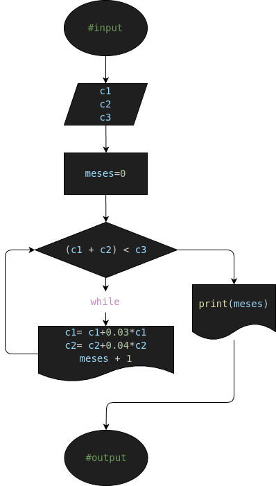

# ej5: capital_calculator
Programa en Python para calcular en cuántos meses, uniendo los dos capitales, Pedro y Juan pueden hacer el negocio que desean.

## Analisis

### Descripcion (Detallada)

- Pedro tiene un capital de c1 pesos, y Juan uno de c2 pesos.  Uniendo los dos no les alcanza para hacer un negocio que requiere una inversión de c3 pesos.  Deciden colocar cada uno su capital a ganar interés.  Pedro lo colocó a un interés compuesto del 3% mensual, y Juan al 4% mensual.  Hacer el diagrama de flujo y el programa en Python que calcule e imprima en cuántos meses, uniendo los dos capitales, pueden hacer el negocio que desean.

### Variable de entrada (#input)
- c1= Capital de Pedro
- c2= Capital de Juan
- c3= Inversion para el Negocio

### Procesamiento y Almacenamiento (#processing&storage)
- meses= 0
---
-  while(c1 + c2) < c3: 
    - c1= c1*1.03
    - c2= c2*1.04
    - meses += 1

## Diseño

## Construccion
- C0D1G0 1MPL3M3NT4D0 EN "ej5.py" :3